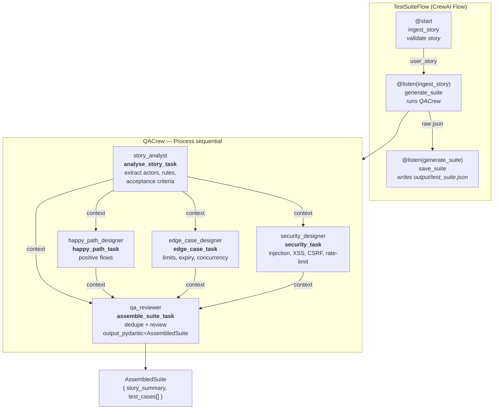

# QACrew — Agent Workflow

This diagram shows how the CrewAI **`TestSuiteFlow`** orchestrates the **`QACrew`**
(5 agents / 5 tasks, `Process.sequential`) to turn a single user story into a
schema-validated JSON test suite.

## Flow + Crew overview

## How to read it

- **Flow layer** — three sequential steps wired with `@start` / `@listen`.
  Only these appear in CrewAI's native `plot()` output
  (`test_suite_flow.html`).
- **Crew layer** — the five agents that execute inside `generate_suite`:
  1. `story_analyst` runs first; its analysis becomes the `context` for every
     downstream task.
  2. `happy_path_designer`, `edge_case_designer`, and `security_designer` each
     produce their category of test cases.
  3. `qa_reviewer` consumes **all four** prior outputs, removes duplicates, and
     emits the final schema-validated `AssembledSuite`
     (enforced via `output_pydantic`).

## Categories produced

| Agent | Task | `TestCategory` |
|-------|------|----------------|
| `happy_path_designer` | `happy_path_task` | `happy_path` |
| `edge_case_designer` | `edge_case_task` | `boundary_edge_case` |
| `security_designer` | `security_task` | `security_validation` |
